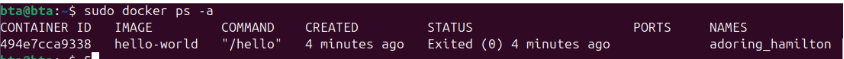
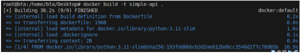
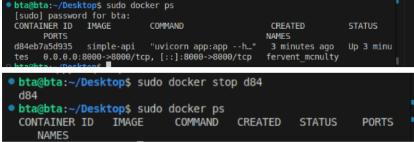
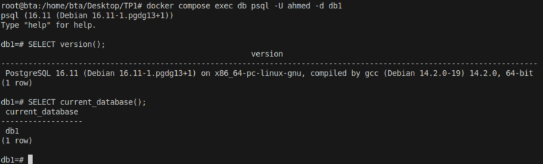
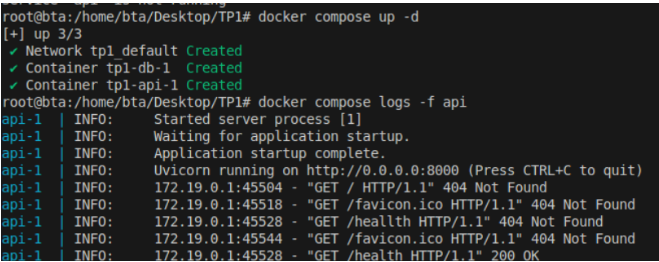
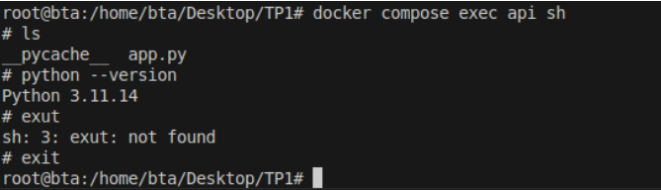
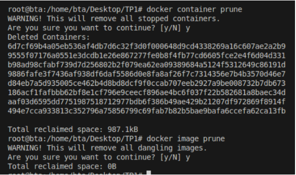

# Rapport TP1 / CSC8613

## Exercice 1 : Installation de Docker

- "docker run hello-world" exécute un conteneur qui affiche un message confirmant que Docker fonctionne.
- "docker ps -a" affiche tous les conteneurs, y compris ceux arrêtés.Du coup on y voit  le conteneur hello-world avec le statut Exited, ce qui est normal car il ne fait qu'afficher un message avant de s’arrêter.

---

## Exercice 2 : Images et conteneurs

- Une **image** est un modèle figé .. un “snapshot” contenant un système de fichiers, des dépendances et une configuration.
- Un **conteneur** est une instance active de cette image qui a son propre cycle de vie (on peut initaliaser plusieurs conteneurs a partir la meme image et toute modification dans cette instance ne change pas l'image).

Docker télécharge l’image Alpine (si elle n’est pas installé en locale) , crée un conteneur et excute la commande echo et le conteneur s’arrête une fois la commande est terminée

 ce conteneur n’avait qu’une seule commande à exécuter (echo)
Une fois fait dinc il s’arrête car il n’a plus rien à exécuter

ls affiche les fichiers disponibles.
uname -a montre toutes les infos du noyau de la machine hôte (les conteneurs partagent le noyau).
exit ferme le conteneur

## Exercice 3 : Création d’une API FastAPI

## Exercice 4 : Exécution de l’API

Différence :

docker ps affiche uniquement les conteneurs en cours d’exécution.

docker ps -a affiche tous les conteneurs, y compris ceux qui sont arrêtés

## Exercice 5 : Démarrer un mini-système multi-conteneurs avec Docker Compose

docker stop id arrête un seul conteneur et ne le supprime pas le conteneur, il reste visible dans docker ps -a.
Tandis que docker compose down arrête tous les services définis dans docker-compose.yml et Supprime les conteneurs associés à ce projet donc l’environnement (pour cette stack) est “nettoyé” en une seule commande.

## Exercice 6 : Interagir avec la base de données PostgreSQL dans un conteneur

exec exécute une commande dans un conteneur 

-U demo indique l'user

-d demo indique la base

avec -v Les volumes sont aussi supprimés, donc la base est effacée.

## Exercice 7 : Déboguer des conteneurs Docker : commandes essentielles et bonnes pratiques
au démarrage : messages Uvicorn / FastAPI, “Application startup complete”, etc.

quand on fait l'appel /health : une ligne GET /health ... 200 OK.

ls montre les fichiers (app.py et __pycache__).

python --version affiche la version de Python dans le conteneur.

exit ferme le shell.

Un redémarrage est utile lorsqu’on modifie le code de l’API ou sa configuration , un service reste bloqué ou ne répond plus lorsqu’une dépendance a été relancée (ex : la base PostgreSQL) et que l’API doit rétablir la connexion  ou bien lorsqu’un bug temporaire nécessite simplement de relancer le process.

Les logs montrent une trace d’erreur indiquant que uvicorn ne trouve pas app et suggère plutot d'utiliser appa 

ces commandes permettent de supprimer les conteneurs arrêtés et les images inutilisées pour éviter l’accumulation de vieux conteneurs / images et libèrent de l’espace disque. 

## Exercice 8 : Questions de réflexion et consignes pour le rendu

**Pourquoi un notebook Jupyter n’est pas adapté pour un déploiement ML ?**

Un notebook Jupyter est pratique pour l’exploration, mais pas pour la production. L’exécution n’est pas reproductible, car l’ordre des cellules peut changer les résultats. L’environnement n’est pas strictement contrôlé, ce qui rend difficile de garantir les mêmes dépendances partout. De plus, un notebook n’est pas fait pour tourner en continu comme une API, et il s’intègre mal dans des pipelines automatisés CI/CD. Pour un déploiement fiable, il vaut mieux utiliser un code structuré dans un environnement maîtrisé, comme un conteneur Docker.

**Pourquoi Docker Compose est essentiel ?**

Docker Compose est essentiel lorsqu’on utilise plusieurs services, car il permet de les lancer tous en une seule commande et de les configurer de façon cohérente. Il garantit un environnement reproductible et partageable, tout en gérant automatiquement le réseau et les dépendances entre les conteneurs. Cela simplifie énormément la gestion d’un système composé d’une API, d’une base de données et d’autres services.