# Rapport TP2 / CSC8613

## Exercice 1 : Mise en place du projet et du rapport

Notre dépôt a la bonne structure:

un dossier api , un dossier reports et un fichier docker-compose.yml 
(j'ai pris la capture d'écran aprés la question 1.b )

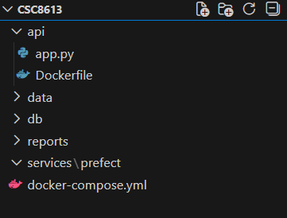

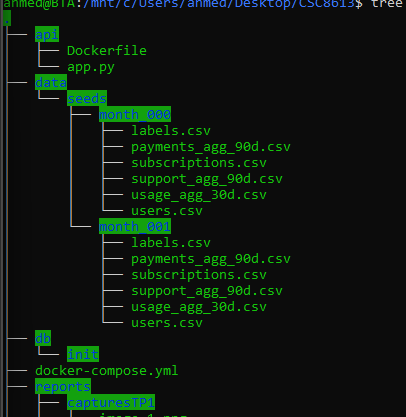

Structure des données:

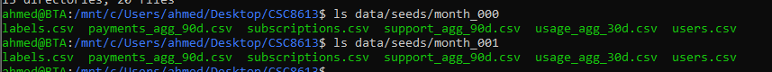

## Exercice 2 : Base de données et docker-compose

le fichier d'initialisation de notre base de données : db/init/001_schema.sql.
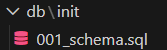

Le fichier .env sert à définir les variables d’environnement utilisées ( passwords , ports ..) par les conteneurs Docker sans les coder en dur dans les fichiers du projet et faciliter leur modification et éviter leur exposition.

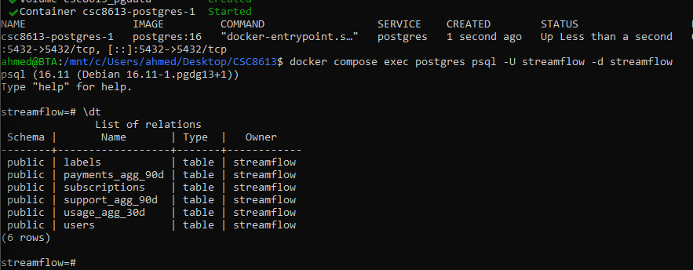

Les tables présentes dans la base correspondent au schéma défini dans db/init/001_schema.sql. Elles couvrent les informations utilisateurs, les abonnements, l’usage, les paiements, le support client et la variable cible de churn.

Schéma : 

**labels** : indicateur de churn.

**users** : informations et identifiants des utilisateurs.

**payments_agg_90d** : échecs de paiement sur 90 jours.

**subscriptions** : données contractuelles et de facturation.

**support_agg_90d** : interactions avec le support sur 90 jours.

**usage_agg_30d** : métriques d’usage sur 30 jours. 

## Exercice 3 : Upsert des CSV avec Prefect (month_000)

J’ai créé le service Prefect pour orchestrer le pipeline d’ingestion. J’ai commencé par définir le conteneur Prefect avec un Dockerfile et un fichier requirements.txt. 

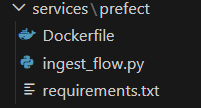

Ensuite, j’ai mis en place un premier flow qui lit les fichiers CSV du mois month_000 et les insère dans PostgreSQL à l’aide d’un upsert. 

Cette approche permet d’ajouter de nouvelles données tout en mettant à jour celles qui existent déjà. 

Une fois PostgreSQL lancé, j’ai démarré le service Prefect, exécuté le flow d’ingestion, puis vérifié que les données avaient bien été insérées dans la base.

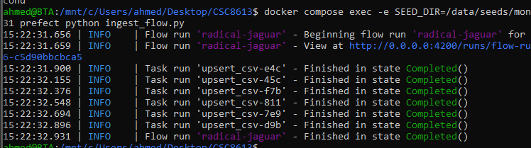

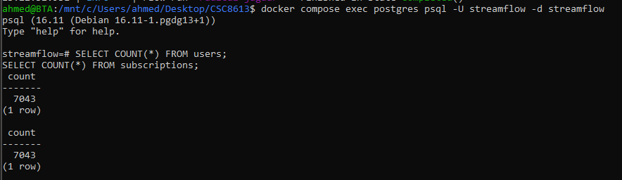

Il y a donc 7043 clients après month_000.

## Exercice 4 : Validation des données avec Great Expectations

### Le rôle de validate_with_ge :
La fonction validate_with_ge permet d’intégrer Great Expectations au pipeline d’ingestion afin de contrôler la qualité des données. Elle vérifie que les données respectent des règles de cohérence telles que le schéma attendu, la validité des valeurs et l’intégrité des clés. En cas d’échec d’une validation, le pipeline est immédiatement interrompu, ce qui évite de propager des données incorrectes vers les étapes suivantes, comme le Feature Store ou l’entraînement des modèles.

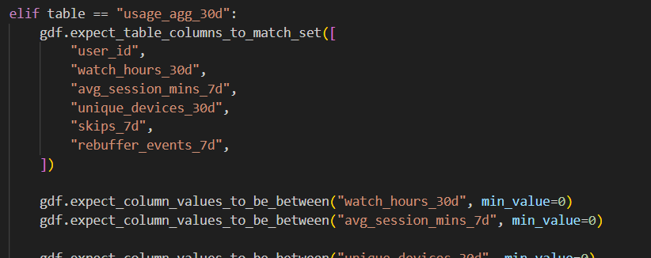

**Choix des bornes** : Une borne inférieure de 0 a été retenue, car ces métriques correspondent à des durées réelles. Un temps de visionnage ou une durée moyenne de session ne peuvent pas être négatifs. La présence de valeurs inférieures à zéro indiquerait nécessairement une erreur de calcul en amont (par exemple lors du traitement des horodatages) ou une corruption des données sources.

**Protection du modèle** : Ces règles jouent le rôle de garde-fou pour le pipeline de données en filtrant les valeurs incohérentes avant l’entraînement. Elles permettent d’éviter l’introduction de données aberrantes susceptibles de biaiser le modèle et contribuent ainsi à la fiabilité des prédictions de churn.

## Exercice 5 : Snapshots et ingestion month_001

Les deux requêtes retournent 7043 lignes pour 2024-01-31 et 2024-02-29. Cela signifie que le nombre d’utilisateurs présents dans les données n’a pas changé entre month_000 et month_001 : les fichiers sources contiennent le même nombre de user_id, donc les snapshots enregistrent le même volume de clients aux deux dates.

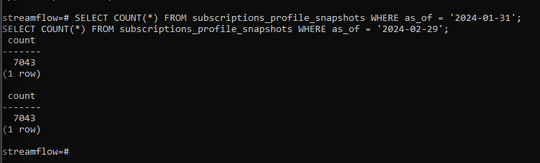

On aurait pu obtenir davantage de lignes en février si de nouveaux utilisateurs étaient apparus dans month_001 (nouveaux user_id).

## Synthèse du TP2 : Ingestion et Historisation

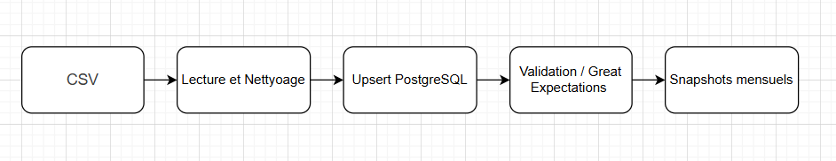

###  Pourquoi ne pas utiliser les tables live ?
Les tables live évoluent en permanence. Les utiliser pour entraîner un modèle rendrait les résultats non reproductibles et ferait perdre l’historique des données.
### Pourquoi les snapshots sont importants ?
Les snapshots figent l’état des données à un instant donné, évitant ainsi la data leakage et garantissant une cohérence temporelle entre les données et les prédictions.
### Réflexion personnelle
La mise en place des snapshots a été la partie la plus complexe, mais elle est essentielle pour obtenir un modèle fiable. Une erreur d’ordre d’exécution des ingestions a été corrigée en relançant les deux mois depuis le début.