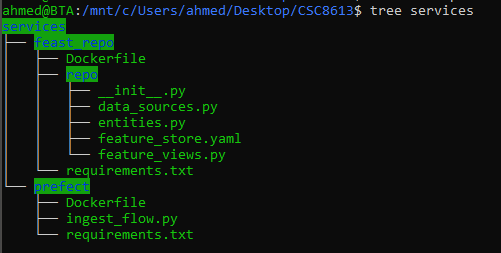
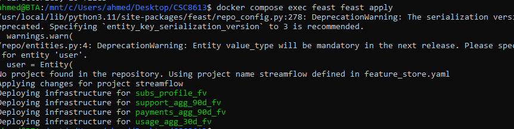
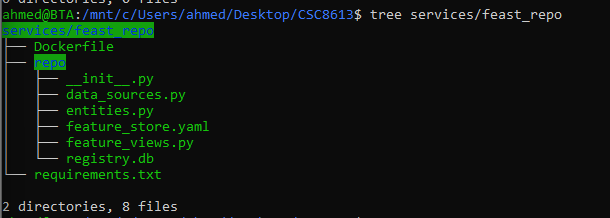
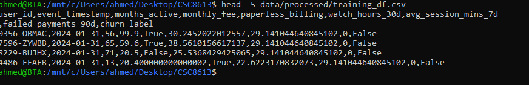
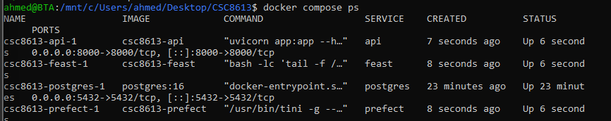
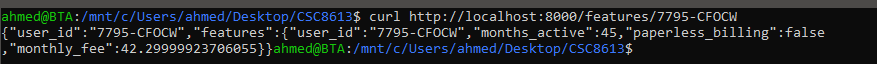

# Rapport TP3 / CSC8613

# Contexte
Lors des TP précédents, nous avons mis en place le pipeline de données, comprenant l’ingestion des données, leur validation à l’aide de Great Expectations et la création de snapshots temporels afin de figer l’état des données à des dates de référence.

Dans le cadre de ce TP, nous disposons de deux snapshots mensuels, `month_000` et `month_001`, correspondant respectivement aux dates du **31 janvier 2024** et du **29 février 2024**. Ces snapshots constituent des vues cohérentes et historisées des données, destinées à être exploitées pour des usages analytiques et de machine learning.

Chaque snapshot est composé de six tables couvrant différents domaines métier :

- **labels** : fournit la variable cible indiquant si un utilisateur a résilié son abonnement (*churn*) ou non.
- **users** : centralise les informations d’identification et les attributs statiques des utilisateurs 
- **subscriptions** : décrit le profil d’abonnement des utilisateurs (type de contrat, options souscrites, présence de publicité, montants facturés) 
- **payments_agg_90d** : agrège les incidents de paiement observés sur une fenêtre glissante de 90 jours 
- **support_agg_90d** : synthétise les interactions avec le support client, notamment le nombre de tickets et le temps moyen de résolution sur une période de 90 jours 
- **usage_agg_30d** : regroupe les métriques d’usage et d’engagement de la plateforme (temps de visionnage, incidents techniques) calculées sur les 30 derniers jours 

Le but de ce TP :
- brancher Feast à nos données
- récupérer des features en mode offline et online
- exposer un endpoint API simple

# Mise en place de Feast

### Rôle du conteneur Feast

le Feature Store Feast a été ajouté à l’architecture Docker existante afin de gérer les features . Ce conteneur est utilisé pour lancer les commandes Feast et pour accéder aux données stockées dans PostgreSQL, aussi bien pour les usages offline que online et assurer que ces features  sont identiques lors de l'entraînement (Offline) et de l'inférence (Online).
La configuration se trouve dans **/repo**
On utilise **docker compose exec feast** pour enregistrer les définitions avec **feast apply** et charger les données temps réel avec **feast materialize**.

# Définition du Feature Store

# Définition du Feature Store

## Entity

Dans Feast, une *Entity* représente l’objet métier sur lequel les features sont définies (et qui sert de point de jointure). Dans notre cas, l’entité centrale est l’utilisateur.

Le choix de `user_id` comme clé de jointure est naturel, car cette colonne est présente dans toutes les tables de snapshots et identifie de façon unique un client. Cela permet de relier correctement les features issues de plusieurs sources (abonnement, usage, paiements, support) au même utilisateur.

## DataSources (snapshots)

Par exemple, la table `usage_agg_30d_snapshots` contient des indicateurs d’usage calculés sur 30 jours, tels que `watch_hours_30d`, `avg_session_mins_7d`, `unique_devices_30d` et `rebuffer_events_7d`. 

Chaque source Feast sélectionne uniquement `user_id`, `as_of` et les colonnes de features nécessaires, avec `as_of` comme référence temporelle.

## FeatureViews et feast apply
Les FeatureViews regroupent les features par entité et par source (profil d’abonnement, usage, paiements, support).

## Rôle de feast apply

La commande `feast apply` permet de déployer la configuration du Feature Store. Elle analyse les fichiers Python du dépôt Feast afin d’identifier les Entities et les FeatureViews définies, puis met à jour le registre central (`registry.db`).

Cette étape prépare également l’infrastructure nécessaire côté stockage, notamment en s’assurant que les structures requises sont disponibles dans PostgreSQL, afin que les features puissent ensuite être récupérées aussi bien en mode offline qu’en mode online.

# Récupération offline & online

### Temporal correctness avec Feast

Feast garantit la cohérence temporelle en effectuant une jointure *point-in-time* entre le timestamp fourni dans le `entity_df` (`event_timestamp`) et la colonne temporelle définie dans les sources de données (`timestamp_field="as_of"`). Pour chaque observation du jeu de données, Feast ne récupère que les valeurs de features valides à cet instant précis — ici le 31 janvier 2024 — et exclut toute information issue de mises à jour postérieures.

Ce mécanisme permet d’éviter toute fuite d’information depuis le futur (*data leakage*) et assure que le modèle est entraîné dans des conditions cohérentes avec celles rencontrées en production.

En revanche, si l’on interroge un `user_id` inexistant ou pour lequel aucune feature n’a été matérialisée dans l’Online Store, Feast ne renvoie pas d’erreur. Les valeurs retournées pour les features demandées sont simplement nulles (`None`), ce qui permet de gérer proprement ces cas côté application.

# Réflexion

L’endpoint `/features/{user_id}`, reposant sur Feast, contribue à réduire le *training-serving skew* (écart entre les données utilisées à l’entraînement et celles servies en production) en s’appuyant exactement sur les mêmes FeatureViews que celles utilisées pour construire le jeu de données d’entraînement. 

En centralisant la définition et le calcul des features pour les usages offline (historique) et online (serving), Feast garantit une source unique de vérité. Cela limite fortement les risques d’incohérences tout au long de la chaîne de production, depuis l’ingénierie des données jusqu’au déploiement du modèle, en passant par les phases de data science et de ML engineering.

