# Rapport TP3 / CSC8613

## Exercice 1 : Mise en route + rappel de contexte (sanity checks + où on en est dans la pipeline)

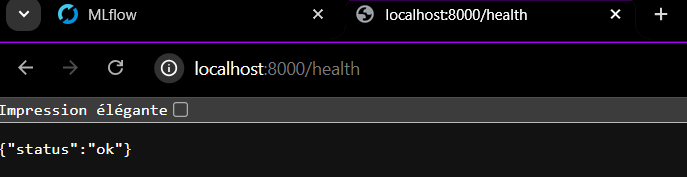

## Exercice 2 : Créer un script d’entraînement + tracking MLflow (baseline RandomForest)

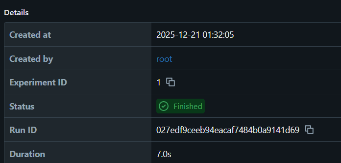

duration: *7s*

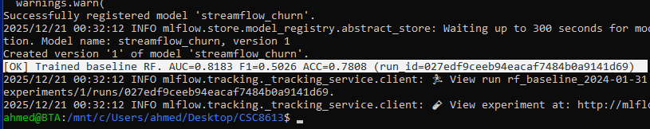

AS_OF utilisé : *2024-01-31*

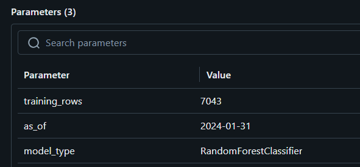

nombre de lignes: *7043*

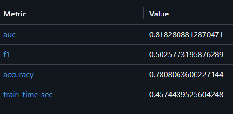

le score des 3 métriques est :  AUC=0.818280  F1=0.502577 ACC=0.780806

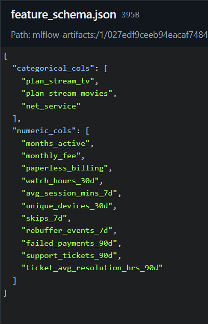

cat_cols identifiés sont : 

"categorical_cols": [
    "plan_stream_tv",
    "plan_stream_movies",
    "net_service"
  ]

### Importance de AS_OF et random_state

Le paramètre **AS_OF** est fixé afin de garantir que le dataset d’entraînement soit strictement identique à chaque exécution du script. Il permet de figer le point temporel auquel les features sont récupérées (via les snapshots et la jointure point-in-time). Sans ce paramètre, le script utiliserait les données les plus récentes, ce qui ferait varier le dataset d’une exécution à l’autre et rendrait la reproductibilité impossible.

Le paramètre **random_state** est quant à lui fixé pour rendre déterministes toutes les opérations aléatoires du pipeline, comme le *découpage train/validation* ou *l’entraînement du modèle* (RandomForest). Ainsi, pour des données identiques, deux exécutions successives produisent exactement le même modèle et les mêmes métriques.

*Ces deux paramètres sont essentiels en MLOps, car ils garantissent la reproductibilité, la comparabilité des runs MLflow et facilitent le debugging et l’audit des modèles en production.*

## Exercice 3 : Explorer l’interface MLflow et promouvoir un modèle

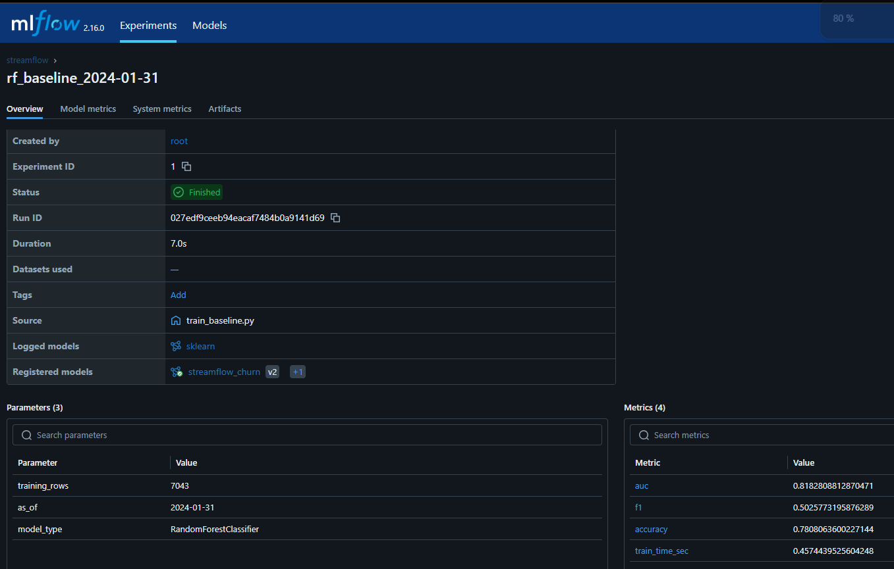

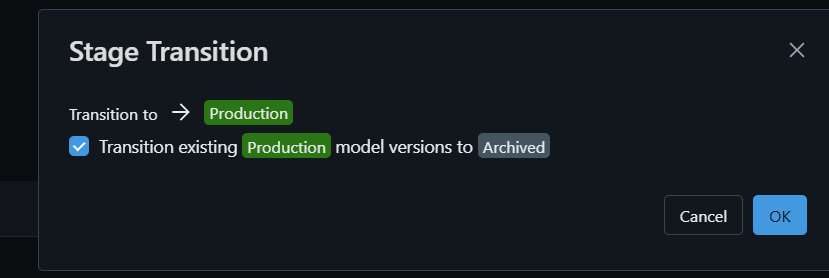

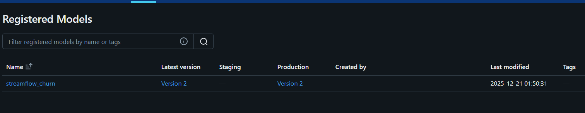

numéro de version:  *version 2* 

### Importance de l’interface de promotion des modèles

La promotion d’un modèle via l’interface est préférable à un déploiement manuel, car elle assure une traçabilité complète de chaque promotion, avec l’historique des versions et les timestamps associés. Cela permet de savoir précisément quel modèle est en production, quand il a été promu et à partir de quel entraînement.

L’interface facilite également les opérations de rollback : toutes les versions du modèle étant conservées, il suffit de changer le stage de deux versions pour revenir rapidement à un état stable, sans manipulation de fichiers ni redéploiement complexe.

De plus, l’existence d’un stage Staging avant la Production offre un espace tampon pour valider un modèle (tests, monitoring, sanity checks) avant son exposition réelle, ce qui réduit fortement les risques d’incidents en production.

Enfin, cette approche s’intègre naturellement dans des pipelines CI/CD, en fournissant un point de contrôle centralisé, automatisable et indépendant des environnements locaux.

## Exercice 4 : Étendre l’API pour exposer /predict (serving minimal end-to-end)

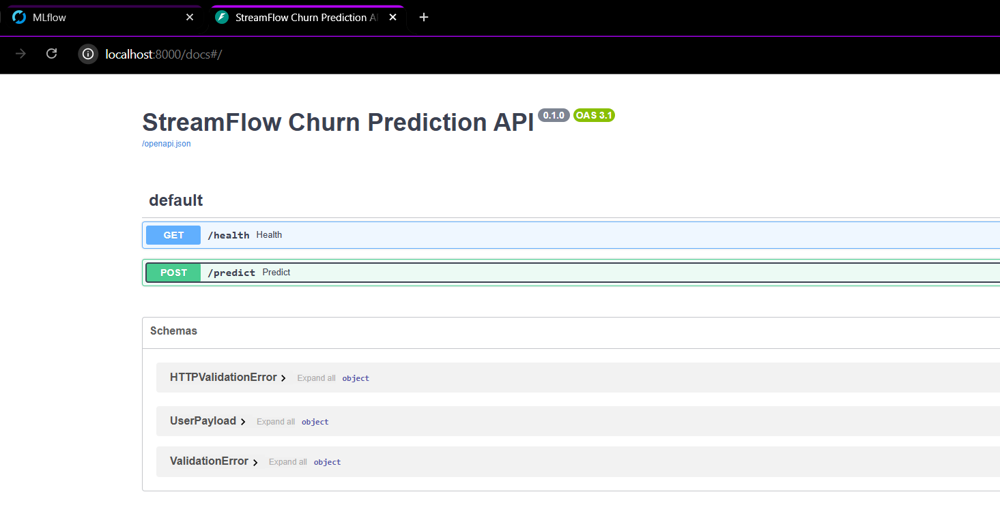

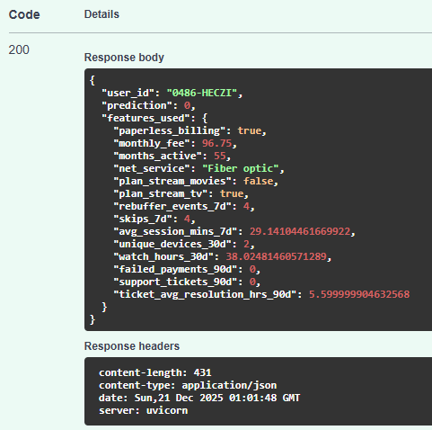

Le modèle prédit un churn pour cet utilisateur. Par ailleurs, l’API charge le modèle via l’URI models:/streamflow_churn/Production plutôt qu’à partir d’un fichier local. Cette approche permet de s’abstraire de la gestion des versions côté API, qui n’a pas besoin d’être modifiée lors d’une mise à jour du modèle.

La promotion, la mise à jour ou le rollback d’une version deviennent ainsi immédiats, puisqu’il suffit de changer le stage dans le Model Registry sans toucher au code ni au déploiement de l’API. En outre, cette méthode réduit les risques d’erreurs liés à la duplication de fichiers, aux chemins locaux ou à des conventions de nommage complexes, tout en améliorant la robustesse et la maintenabilité du système.

## Exercice 4 : Etendre l’API pour exposer /predict (serving minimal end-to-end)
Tests user_id existant 

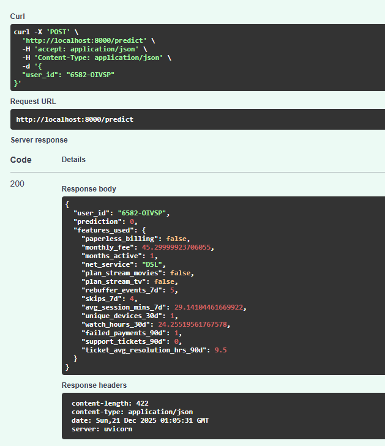

En effet, ici le modèle ne connait pas le user et donc ne peut rien prédire.

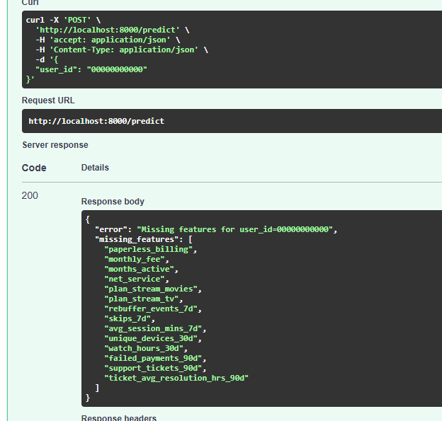

### Robustesse du serving

Deux causes principales peuvent entraîner des échecs lors du serving.
La première est l’entité absente : le *user_id* demandé n’existe pas dans l’online store Feast, ce qui conduit au retour de valeurs NULL pour l’ensemble des features.
La seconde est un online store obsolète : la matérialisation des features est manquante ou n’est pas à jour (stale), ce qui se traduit par des valeurs partielles ou absentes côté API.

L’API détecte ces deux situations grâce au contrôle X.isnull() et renvoie une erreur explicite accompagnée de la liste des missing_features. Sans cette vérification, le modèle produirait des prédictions silencieuses sur des données incomplètes, ce qui constitue un risque important en production.

## Exercice 6 : Réflexion de synthèse (ingénierie MLOps)
### Avantages de MLflow

MLflow assure une traçabilité complète des entraînements : chaque exécution est enregistrée avec un run_id unique, ainsi que l’ensemble des paramètres, métriques et artefacts associés. Le Model Registry permet d’organiser les différentes versions du modèle et leurs stages (None, Staging, Production), ce qui simplifie fortement les opérations de rollback. Revenir à une version antérieure consiste simplement à modifier son stage, sans changer le code ni redéployer l’application.

### Rôle du stage Production

Le stage Production définit la version du modèle utilisée par l’API via l’URI models:/streamflow_churn/Production. À chaque démarrage (ou chargement), l’API récupère automatiquement la version marquée comme Production, sans dépendre d’un numéro de version explicite. Cette approche permet des rollbacks instantanés par simple relabellisation d’une version et réduit les risques d’erreurs manuelles (mauvais fichier ou mauvaise version). Elle facilite également l’intégration dans des pipelines CI/CD en découplant le versioning du modèle du code applicatif.

### Limites restantes pour la reproductibilité

Même avec une chaîne MLOps complète (Feast, Prefect, PostgreSQL, MLflow et Docker), la reproductibilité peut encore être compromise dans certains cas. Par exemple, si les données PostgreSQL sont modifiées sans snapshots bruts, si les images Docker utilisent des tags flottants (comme python:3.10, susceptibles d’évoluer silencieusement), ou encore si l’online store Feast diverge de l’offline store en raison de processus asynchrones. Ces points montrent que la reproductibilité dépend non seulement des outils, mais aussi de bonnes pratiques opérationnelles.