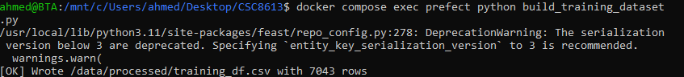
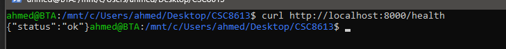
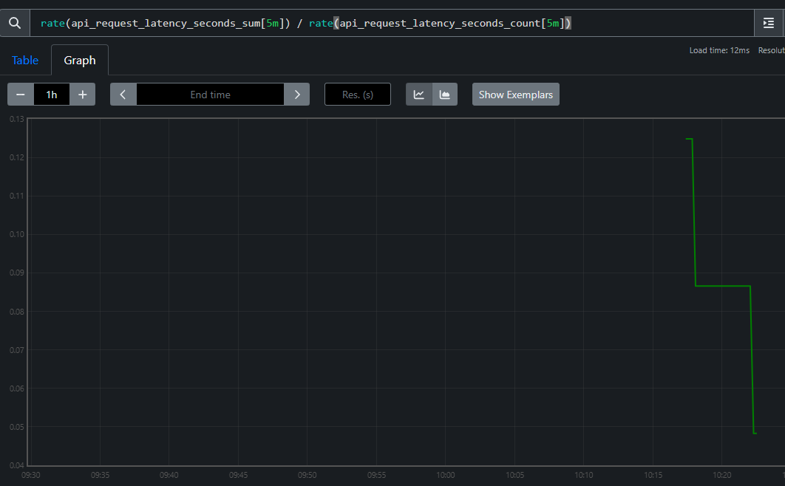
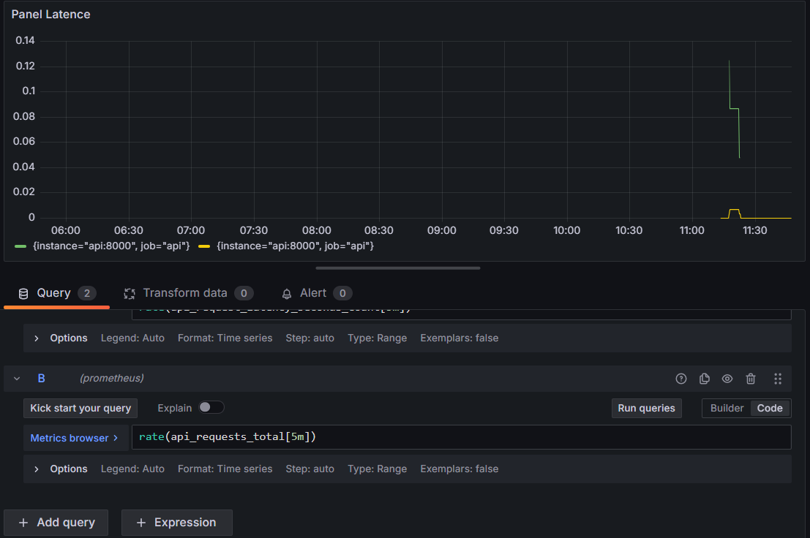
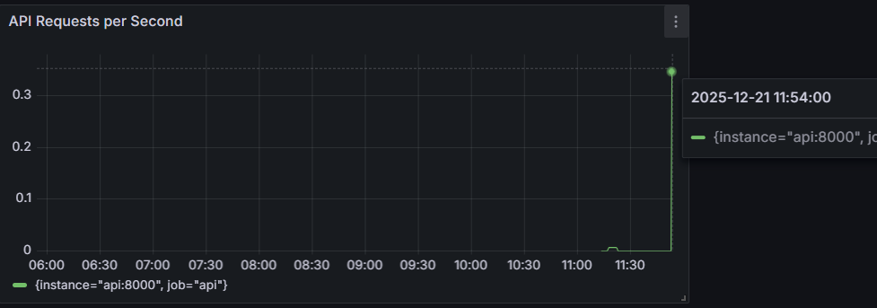
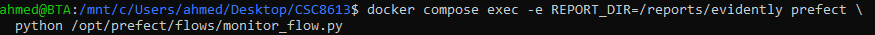
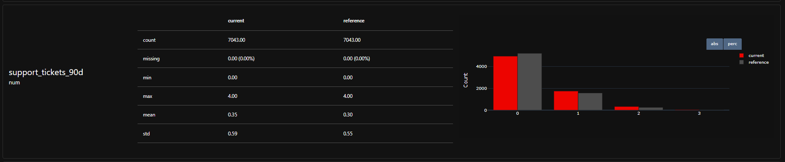
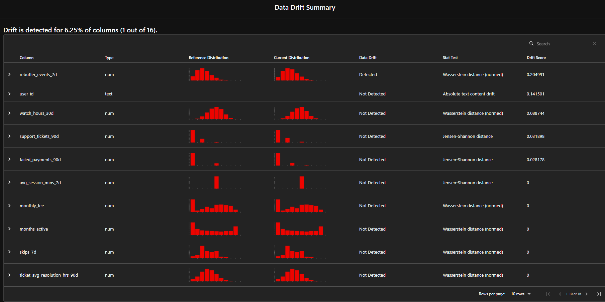
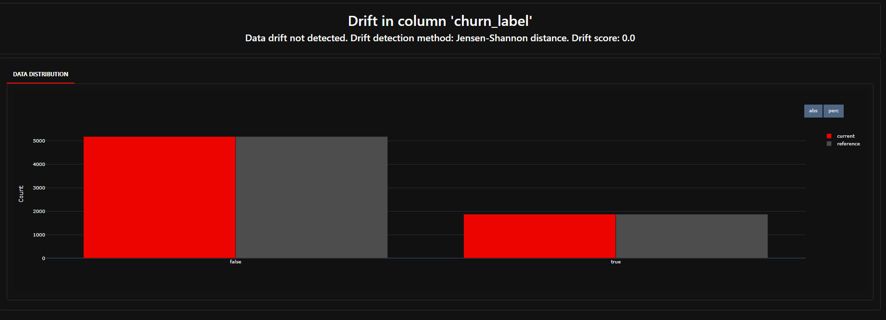

# Rapport TP5 / CSC8613

## Exercice 1 : Démarrer la stack pour l'observabilité

Le fichier docker-compose.yml est mis à jour afin d’intégrer les services Prometheus et Grafana à la stack Docker.
Le fichier de configuration services/prometheus/prometheus.yml est ensuite créé, puis les répertoires nécessaires au provisioning de Grafana sont ajoutés au projet.

La stack Docker est redémarrée et le bon démarrage de l’ensemble des services est vérifié. 

Les interfaces web de Prometheus et de Grafana sont accessibles sans problème.

Les conteneurs associés sont **streamflow-prometheus** et **streamflow-grafana**. Prometheus utilise l’adresse *api:8000* plutôt que *localhost:8000*, car il s’exécute dans un conteneur Docker distinct : localhost ferait référence à son propre conteneur, tandis que api permet d’accéder au conteneur de l’API via le réseau interne Docker.

## Exercice 2 : Instrumentation de FastAPI avec de métriques Prometheus

 on lance la commande suivante pour voir si on récupère bien les metrics:

J'ai exécuté la prédiction pour des differents users pour voir l'évolution des metrics

A présent quand on appelle le endpoint /metrics, on a :

On remarque en effet que api_requests_total 2.0 alors qu'avant api_requests_total 0.0 .
Les métriques associées à api_request_latency_seconds ont augmenté après les appels à l’API. 
Un **histogramme** est plus utile qu’une simple moyenne de latence car il permet d’observer la distribution complète des temps de réponse. Il met en évidence la présence de requêtes lentes ou de pics de latence qui seraient masqués par une moyenne globale. Grâce aux buckets, il est possible d’estimer des percentiles (p95, p99), plus représentatifs de l’expérience utilisateur réelle. Cela facilite la détection de dégradations ponctuelles ou progressives des performances.

## Exercice 3 :  Exploration de Prometheus (Targets, Scrapes, PromQL)
La page Status / Targets de Prometheus montre que la cible correspondant à l’API est bien en état UP. Cela confirme que Prometheus parvient à contacter l’endpoint /metrics et à récupérer les métriques régulièrement.

La requête **up** renvoie la valeur 1, indiquant que l’API est disponible.

La métrique **api_requests_total** augmente au moment des appels à l’endpoint /predict, ce qui correspond au trafic généré manuellement.

La requête **rate(api_requests_total[5m])** permet d’observer le nombre moyen de requêtes par seconde sur les cinq dernières minutes et met clairement en évidence le pic de trafic.

Enfin, la requête
**rate(api_request_latency_seconds_sum[5m]) / rate(api_request_latency_seconds_count[5m])** fournit une estimation de la latence moyenne des requêtes sur la période observée. Les variations visibles sont cohérentes avec le trafic généré et reflètent le temps de réponse réel de l’API.

## Exercice 4 : Setup de Grafana Setup et création d'un dashboard minimal

Après l’exécution de la requête, un rafraîchissement de Grafana montre clairement une augmentation brutale du nombre de requêtes, qui atteint 102 appels.

Les métriques techniques telles que le nombre de requêtes par seconde ou la latence permettent de surveiller la santé opérationnelle de l’API, en détectant notamment les pics de charge ou les ralentissements. En revanche, elles ne donnent aucune indication sur les performances du modèle lui-même : une API peut répondre rapidement tout en produisant des prédictions erronées, par exemple en cas de drift des données ou de dégradation de la précision du modèle.

## Exercice 5 : Drift Detection with Evidently (Month_000 vs Month_001)

J'ai créé fichier services/prefect/monitor_flow.py qui charge le dataset "final", exécute un rapport Evidently et produit un signal scalre. Il calcule le target drift simple si churn_label est présent.

décision: NO_ACTION

on peut retrouver tous les détails dans le html créé dans le répertoire reports/evidently.

Dans le rapport on trouve toutes les informations de jeux de données  qui confirme l’absence de problème de schéma entre les périodes.

La détection de drift indique qu’un drift est observé sur 6,25 % des colonnes (1 colonne sur 16), en particulier sur la feature rebuffer_events_7d, pour laquelle une différence de distribution est détectée. Les autres features numériques et catégorielles ne présentent pas de drift significatif entre les deux périodes.

**Différence entre covariate drift et target drift :**
Le covariate drift correspond à un changement de distribution des features d’entrée entre deux périodes, tandis que le target drift correspond à un changement de distribution de la variable cible *(churn_label)*.un léger covariate drift est observé, mais aucun target drift n’est détecté.

