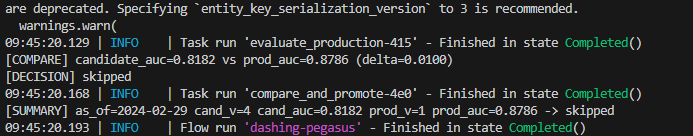
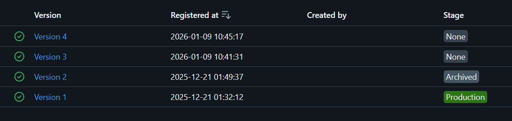
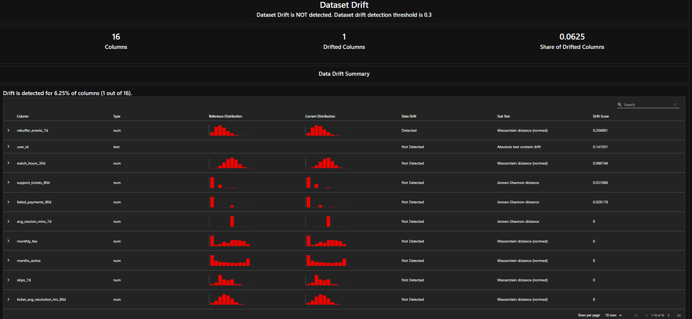

# Rapport TP6 / CSC8613

## Exercice 1 : Mise en place du rapport et vérifications de départ

## Exercice 2 : Ajouter une logique de décision testable (unit test)

On extrait une fonction pure pour les tests unitaires car cela permet d'isoler la logique métier de ses dépendances externes (comme Prefect ou MLflow), la rendant plus simple, plus rapide et plus fiable à tester.

## Exercice 3 : Créer le flow Prefect train_and_compare_flow (train → eval → compare → promote)

  J'ai vérifié dans MLflow et non, une nouvelle version n'a pas été promue.

  En regardant l'interface (MLflow UI), je vois que :
   * La Version 1 est toujours au stage Production.
   * La Version 2 est Archived.
   * Les nouvelles versions (Version 3 et Version 4) sont au stage None.

  L'ancienne version (Version 1) n'a donc pas été archivée et la nouvelle (Version 4) n'a pas
  été promue. Cela est dû au fait que la performance de la nouvelle version n'était pas
  suffisamment meilleure que celle du modèle en production pour justifier un changement, comme
  indiqué par le message [DECISION] skipped dans les logs du flow.

 On utilise un delta pour éviter de promouvoir un nouveau modèle pour une amélioration marginale, voire due au hasard (bruit statistique). Le delta impose que la sur-performance soit significative avant de déclencher une promotion, ce qui amène plus de stabilité au système.

## Exercice 4 : Connecter drift → retraining automatique (monitor_flow.py)

 

## Exercice 5 : Redémarrage API pour charger le nouveau modèle Production + test /predict

 

 L'API doit être redémarrée pour qu'elle puisse recharger le modèle depuis le registre MLflow et ainsi     
  utiliser la nouvelle version qui vient d'être promue en 'Production' après le réentraînement.

## Exercice 6 : CI GitHub Actions (smoke + unit) avec Docker Compose

 Pour les tests d'intégration multi-services en CI, Docker Compose est utilisé pour orchestrer et démarrer 
  rapidement tous les services dépendants (bases de données, API, etc.) dans un environnement isolé et      
  reproductible, simulant ainsi l'environnement de production.

---

## Exercice 7 : Synthèse finale : boucle complète drift → retrain → promotion → serving

Ce TP a permis de mettre en place une boucle MLOps complète, où un changement dans les données peut automatiquement déclencher le réentraînement, l'évaluation et la promotion d'un nouveau modèle en production.

#### Mesure du Drift et Déclenchement
Le **drift des données** est mesuré par le flow de monitoring `monitor_flow.py` qui s'appuie sur la librairie **Evidently**.
- **Mesure** : Evidently compare une fenêtre de données de référence (ex: `month_000`) avec une fenêtre de données courante (ex: `month_001`). Il calcule un `drift_share`, qui représente la proportion de features ayant "drifté" (dont la distribution a statistiquement changé).
- **Seuil** : Un seuil, ici `0.02` (2%), est utilisé comme déclencheur. Si `drift_share` dépasse ce seuil, le système considère que les données ont trop changé et qu'un réentraînement est nécessaire. En pratique, ce seuil serait plus élevé et ajusté en fonction du contexte métier pour éviter des réentraînements trop fréquents et coûteux.

#### Flow `train_and_compare` et Promotion
Lorsque le réentraînement est déclenché, le flow Prefect `train_and_compare_flow` prend le relais.
> 1.  **Entraînement** : Un nouveau modèle "candidat" est entraîné sur les données récentes.
> 2.  **Évaluation** : Sa performance est mesurée, notamment son score `val_auc` sur un jeu de validation.
> 3.  **Comparaison** : Le flow récupère, via l'API MLflow, le modèle actuellement en stage `Production`. Il compare le `val_auc` du modèle candidat à celui du modèle en production.
> 4.  **Promotion** : Si le score du candidat est **strictement supérieur**, il est promu au stage `Production` dans MLflow Model Registry. L'ancien modèle passe automatiquement en `Archived`.

#### Rôles : Prefect vs. GitHub Actions
Les responsabilités sont clairement séparées :
- **Prefect** agit comme l'**orchestrateur du pipeline ML**. Il gère la logique métier : détecter le drift, entraîner, évaluer, comparer et promouvoir les modèles. C'est le cerveau des opérations *de données et de modèles*.
- **GitHub Actions** agit comme l'**orchestrateur de l'intégration continue (CI)**. Il valide le code source : exécution des tests unitaires, vérification de l'intégration des services (`docker compose up`), et s'assure que le code est de qualité avant d'être fusionné. C'est le gardien de la qualité *du code*.

---

### Limites et améliorations

Ce système, bien que fonctionnel, présente plusieurs simplifications. Voici des pistes d'amélioration :

- **Entraînement en CI** :
  > **Pourquoi l'éviter ?** On n'entraîne **jamais** un modèle complet en CI car c'est un processus long, coûteux en ressources et potentiellement non déterministe. Le but de la CI est d'avoir un feedback rapide sur la qualité du code, et un entraînement de plusieurs heures irait à l'encontre de ce principe.

- **Tests manquants** :
  - **Tests de performance du modèle** : Le `val_auc` est un bon début, mais des tests sur des segments de données critiques (ex: utilisateurs à forte valeur) sont nécessaires.
  - **Tests de non-régression** : Vérifier que le nouveau modèle ne performe pas moins bien sur des cas connus.
  - **Tests de validation des données** : Des étapes de validation plus robustes (ex: via Great Expectations) pour détecter des problèmes de qualité avant l'entraînement.
  - **Tests sur le "serving"** : Tests d'intégration pour vérifier que le modèle est correctement servi par l'API après promotion.

- **Gouvernance et approbation humaine** :
  > En production, une promotion 100% automatique est rare. Une **étape d'approbation humaine** est souvent indispensable pour des raisons de **sécurité**, de **réglementation** (ex: GDPR, équité), et de **coût** (un modèle défaillant peut coûter très cher à l'entreprise). MLflow permet de gérer ce cycle de validation en intégrant des transitions manuelles dans le Model Registry (ex: un Data Scientist doit valider le passage de `Staging` à `Production`).
