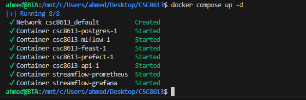
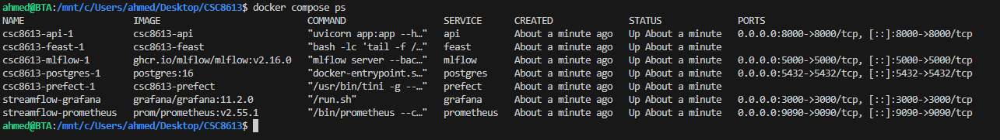
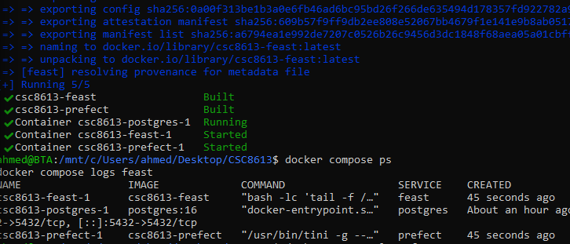
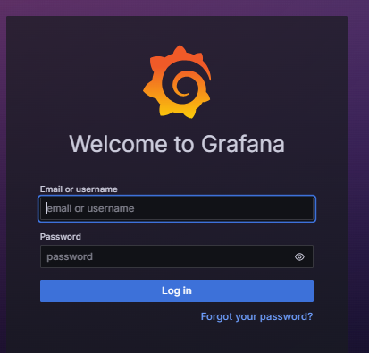
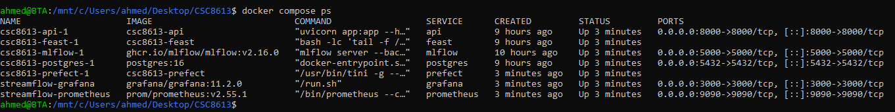
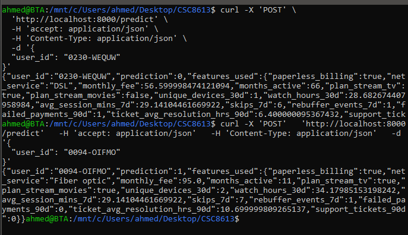
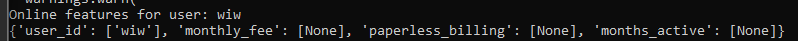
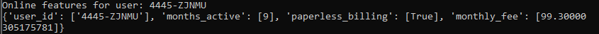
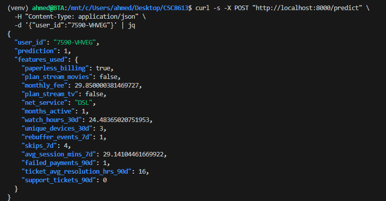

ex1 Mise en place du rapport et vérifications de départ

ex 2 Ajouter une logique de décision testable (unit test)

On extrait une fonction pure pour les tests unitaires car cela permet d'isoler la logique métier de ses dépendances externes (comme Prefect ou MLflow), la rendant plus simple, plus rapide et plus fiable à tester.

ex3 Créer le flow Prefect train_and_compare_flow (train → eval → compare → promote)

  J'ai vérifié dans MLflow et non, une nouvelle version n'a pas été promue.

  En regardant l'interface (MLflow UI), je vois que :
   * La Version 1 est toujours au stage Production.
   * La Version 2 est Archived.
   * Les nouvelles versions (Version 3 et Version 4) sont au stage None.

  L'ancienne version (Version 1) n'a donc pas été archivée et la nouvelle (Version 4) n'a pas
  été promue. Cela est dû au fait que la performance de la nouvelle version n'était pas
  suffisamment meilleure que celle du modèle en production pour justifier un changement, comme
  indiqué par le message [DECISION] skipped dans les logs du flow.

 On utilise un delta pour éviter de promouvoir un nouveau modèle pour une amélioration marginale, voire due au hasard (bruit statistique). Le delta impose que la sur-performance soit significative avant de déclencher une promotion, ce qui amène plus de stabilité au système.

 ex 4 Connecter drift → retraining automatique (monitor_flow.py)

 

 ex5

 

 L'API doit être redémarrée pour qu'elle puisse recharger le modèle depuis le registre MLflow et ainsi     
  utiliser la nouvelle version qui vient d'être promue en 'Production' après le réentraînement.
